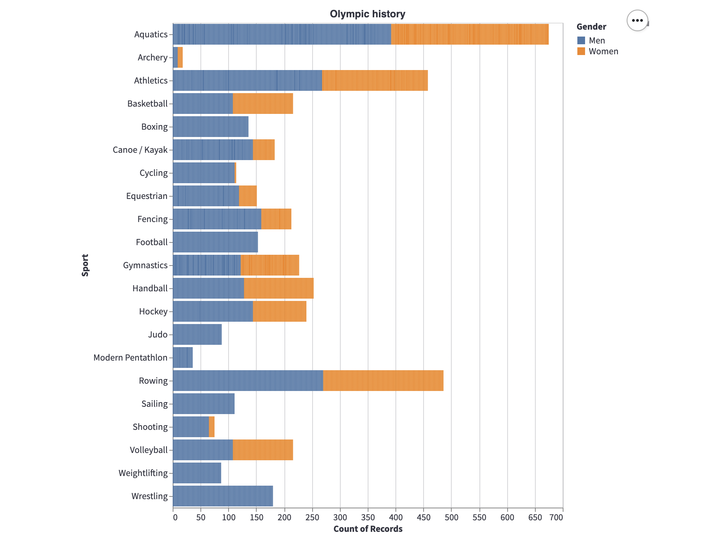
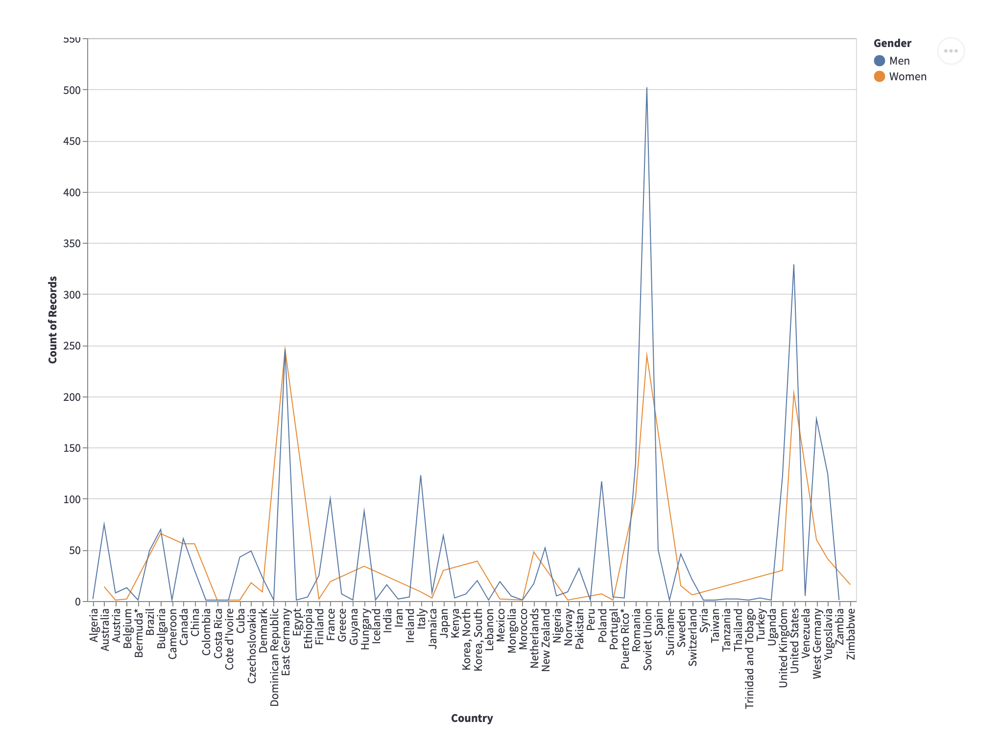
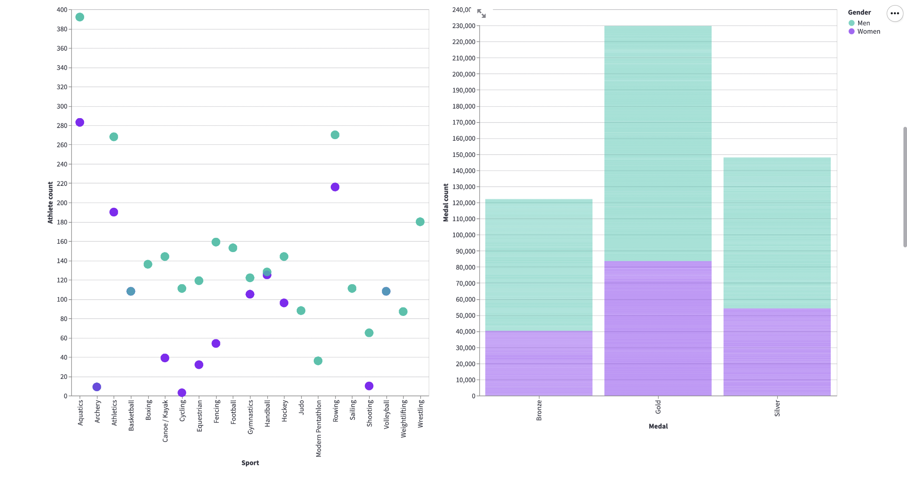
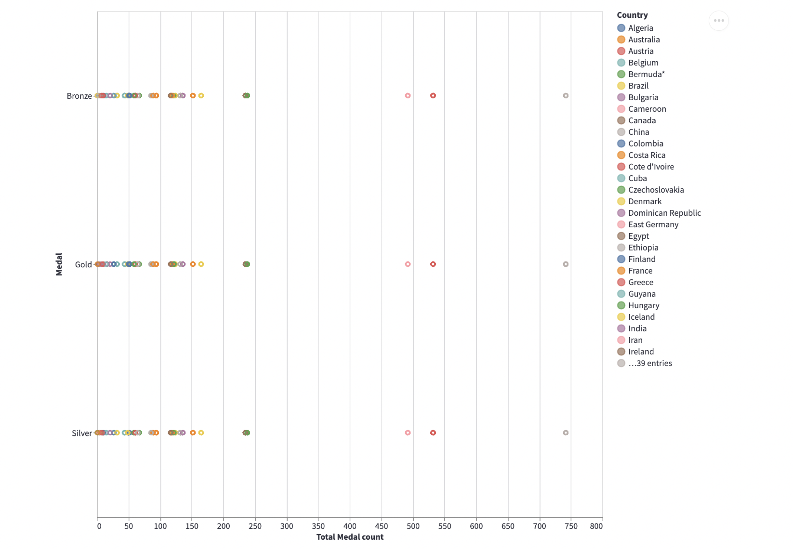
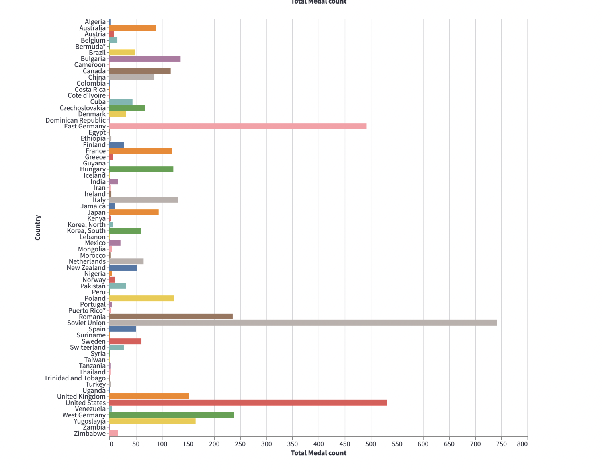
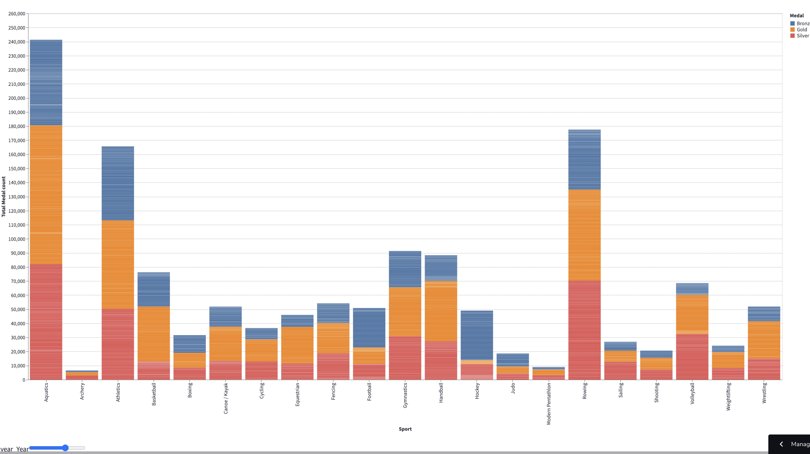

# td

## Project Goals

What is the distribution of medals from 1976 to 1988 across all countries participating in the Olympic Games?

The olympic games is an international sports event wherein thousands of Athletes from all across the globe participate to showcase their talents. Winning an olympic medal is considered to be a historic achievement and hence we wanted to analyze the trends across different athletes participating in the game.We hope that our interactive charts will enable the users to understand how the trends have shifted from 1976 to 1988 and increase their general knowledge in the field of Olympic history.This data visualization is very useful for the user to understand the distribution of athletes and popular sporting events in the olympic games in history. 

## Design

Our main focus was to make the charts interactive and informative for the users. Users have the ability to manipulate the charts to understand from the data. We firstly focused on giving an overview of Olympic history. Then we wanted all our charts to go in further detail to target important issues such as gender disparity amongst athletes across countries not only in medal tally but also in representation across different sports. We wanted to provide the user the ability to manipulate the charts on different legends such as gender, country and sport. 

We considered many other alternatives while brainstorming different visualizations. One of our biggest focuses was to create a world map to highlight the different cities the Olympic games were held in from 1976-1988 and then showcase different interactive graphs including athlete count or medal tally for the different cities. However, we were unable to make the world map interactive and connect it with the different graphs which is why we decided to explore other interactive visualization options. 

## Development

The initial phases which included research and data collection required 4-5 hours of research. Once the topic and data was collected, we together collaborated on cleaning the data. Once data was cleaned we assigned and distributed the task of visualizations. We both thought of two ideas of graphical representations that we wanted to focus on. We first discussed how we wanted our representations to look like and what areas we would like to explore to answer our question. Once, there was a rough sketch and idea of the representation we decided on how to make it interactive for the user. Once that was done we individually dedicated time every day to develop applications. We spent at least 2 hours per day. Understanding how to deal with the large dataset and what visualizations to create was the most time consuming process. 

Firstly, we decided on providing an overall overview of the history of Olympic games from 1976-1988 of representation of different genders in various sports across all years. As the user hovers over the bar they can get detailed information on the athlete, their gender, their country of origin, the year they participated in olympics.

Secondly, we decided to explore more in depth. We decided to use an interactive legend including the different sports played across olympic games from 1976-1988. According to the user’s choice they can select the sport to display and the section will accordingly be bolded to display the medal tally of that country for the respective olympic years. 

Thirdly, we wanted to understand the gender disparity in medals won across different countries. The interactive line graph, helps the user clearly hover over the line which gets bolded to understand and clearly point towards the disparity that exists between medal tally across countries between men and women. 

Fourthly, we created a multi view coordination chart. The chart on the left showed the number of male and women athletes across different sports. And when the user chooses one point male or female, it will showcase the medal count for the medals - gold, silver and bronze for male and female respectively. 

Another multi view visualization, we focused on incorporating the medal count for different medals for all the countries participating in the different olympic games from 1976-1988. When a certain area on the graph is selected with the brush tool the bottom chart will display the countries and their total medal count across all 4 olympic games depending on the user selection on the top chart.

Lastly, users are provided a slider feature to choose which Olympic games sport and medal tally they would like to see. This chart shows the progress and increase in the number of medals given out in some sports in later years.

## Success Story

While analyzing the data and creating charts centered around measures such as Total count of medals and the gender of the participants, we came across trends which highlighted the increase in women participating in events increased drastically.We were able to conclude the massive increase in participation of not very popular sports across the globe such as sailing,fencing and triathlon.

Gender inequality has been a major issue in the domain of sports and it has been reflected through our visualizations.If we look at the number of medals won by Female athletes in comparison to male athletes,it is significantly lower. Females would not get the opportunity to participate in sporting events in the earlier days, but in the current years there has been a massive improvement.

Our visualizations show the evolution of Olympics in terms of Gender,Sport events,countries participating and medals won.It can serve as a very good resource to anyone keen on learning about the Olympic History.We can also implement these visualizations in the curriculum of school students to allow them to learn about the Sport in an exciting way.

